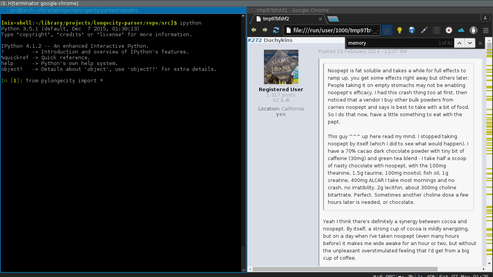

## Pylongecity
### A simple python script to quickly search longecity threads for relevant information


While being very simple, it's still concurrent and uses disk-persistent caching to download each page only once.


The typical use case is finding and filtering posts by phrases or words, authors, date, rating, links (e.g., references to pubmed) or any combination of the above. The `render` method takes a list of posts and shows them in a browser, where it's easier to read. If you want to get the most of it, you probably want to use an interactive shell like `ipython`

The gif below demonstrates finding all posts containing 'memory', then finding all posts with more than 1 like and finding all posts of a user.



### Examples

```python
from pylongecity import *
# Returns List[Post]. This crawls through all pages on a thread and extracts a list of posts.
posts = get_posts('http://www.longecity.org/forum/topic/57030-noopept-long-term-experience-more-than-a-simple-nootropic/')

# Now, we can render posts and open them in a browser
render(posts)

# But most likely we want to filter only to a subset of posts
render([p for p in posts
	if p.author == 'Some author'
    and ('like' in p.rating and p.rating['like'] > 1)
    and p.date.year > 2013
])

# p.content has content of the post. Since searching the content and rending results
# is a common operation, there is a simple helper function called 'search'. 
# It's equavalent to render([p for p in posts if has(p.content, ['word']))
# It accepts *args of words or phrases that must be present in a post. 

# Let's find all posts discussing short term memory.  
search(posts, 'memory', 'short')

# We can also analyze multiple threads at the same time
posts = get_posts(thread1_url, thread2_url, thread3_url)
search(posts, 'aniracetam')

# Let's analize several threads to see all posts containing links to studies
posts = get_posts('http://www.longecity.org/forum/topic/53706-ampakines/',
	'http://www.longecity.org/forum/topic/49993-ampakines-what-is-your-honest-opinion/',
	'http://www.longecity.org/forum/topic/35439-nmda-antagonist-ampakine/',
    'http://www.longecity.org/forum/topic/83603-is-an-ampakine-the-missing-piece-of-ciltp/'
    )
 
# Let's see all posts to pubmed or sciencedirect
render(has_links(posts, 'ncbi', 'sciencedirect'))

# Or all links which are not about buying something on amazon or ebay
render(has_links(posts, '.*', not_=['amazon', 'ebay']))


```

### Quick Reference

The Post obj currently has:

```
id: int
author : str
date : datetime            
rating : Dict[str, int]    # E.g. {'like': 2, 'dislike': 1}
html : str                 # raw html scraped containing whole post
content : str              # text content of the post
```

Browser can be specified with `$BROWSER`.

`get_posts(*urls, cache=False)` if caching is not desired.

The cache is stored in `~/.cache/pylongecity` and can be `rm -rf`'ed at will. 

### Gotchas

No way to invalidate cache if the last page gets updated with a new post after it has been already cached (had no need for it). 

### Installation

Due to `typing`, it needs python >= 3.5.

##### You can install it either using pip:

`pip install pylongecity`

You'll also need to have `joblib`, `pyquery` and `requests2`.

##### Or using the [Nix package manager](https://nixos.org/nix/):

If nix is not installed, [look here for as quick guide.](#nix-installation-if-needed)

###### Once nix is installed

The package is not yet available on nixpkgs, so you will have to
download an expression (`default.nix`) from this repo

`wget https://raw.githubusercontent.com/cyrbon/pylongecity/master/default.nix`

Then just run:

`nix-shell default.nix`

That's it! It's ready to be used and it should drop you into the environment with pylongecity and ipython.

##### Extra packages

If you want extra packages in the environment, you can add them in `default.nix`. At the bottom you'll see the line with 
the list where other packages can be put:

`[ pylongecity ipykernel ];`

##### Nix installation, if needed

Nix currently works **only on linux or mac**. It allows you to create fully reproducible environments or OSes 
and makes package management a breeze of fresh air. Usually, it "just works". **If you don't already have the nix package manager, you can install it using**:

`curl https://nixos.org/nix/install | sh`

Then, create an alias to use it: 

`alias nix='. ~/.nix-profile/etc/profile.d/nix.sh'`

Run the `nix` alias, if you haven't already. 
`nix` makes commands like `nix-shell` and `nix-env` available.
Now we  can drop into the environment with *pylongecity* and  *ipython*.
